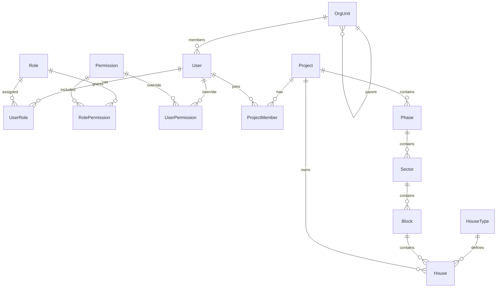
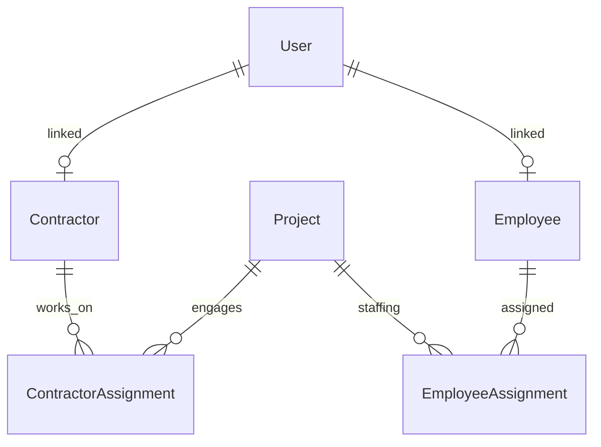
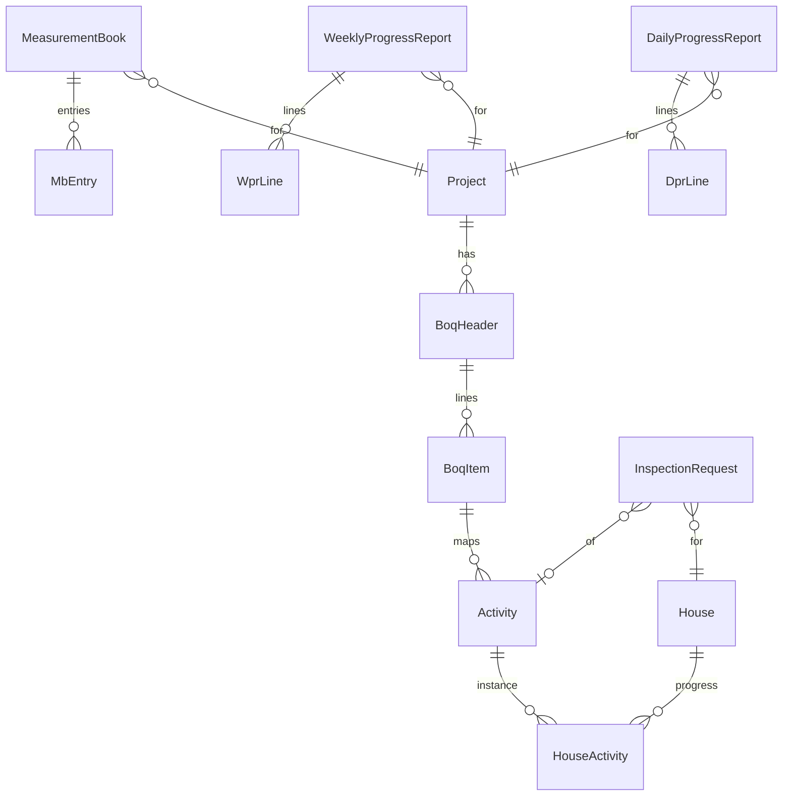
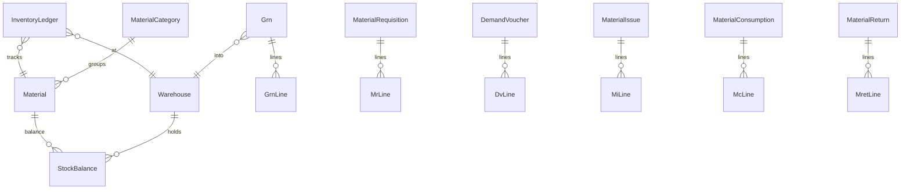

# FAZIA Housing — Database ERD & Data Architecture (v1.0)

> Soft delete, UUIDs, timestamps, and actor stamps apply to all mutable business tables unless noted.

---

## 1. Conventions

### 1.1 Base Columns (all mutable entities)

| Column | Type | Notes |
|---|---|---|
| `id` | UUID | PK, `@default(uuid())` |
| `createdAt` | DateTime | `@default(now())` |
| `updatedAt` | DateTime | `@updatedAt` |
| `deletedAt` | DateTime? | soft delete |
| `createdById` | UUID? | FK → User |
| `updatedById` | UUID? | FK → User |
| `version` | Int | optimistic lock where concurrency matters |

### 1.2 Immutable / Append-Only Tables

- `AuditLog` — never updated/deleted
- `InventoryLedger` — append-only stock movements
- `*History` tables — revision snapshots

### 1.3 Status Pattern

Document types use explicit enums + `status` + optional `WorkflowInstance`.

### 1.4 Numbering

Human-readable codes via sequences / service-generated codes:

`PRJ-2026-0001`, `GRN-000123`, `IR-P1-00045`, etc. Unique per org/project scope.

---

## 2. Conceptual ERD (Mermaid)

### 2.1 Identity, Org, Projects



### 2.2 Workforce



### 2.3 Construction Execution



### 2.4 Inventory



### 2.5 Billing, Finance, Governance

```mermaid
erDiagram
  ContractorBill }o--|| Contractor : billed_by
  ContractorBill }o--|| Project : against
  ContractorBill ||--o{ ContractorBillLine : lines
  ContractorBill }o--o| MeasurementBook : based_on
  Payment }o--|| ContractorBill : settles
  Budget }o--|| Project : for
  Directive }o--|| Project : optional_scope
  Document ||--o{ DocumentLink : attached
  Notification }o--|| User : to
  WorkflowTask }o--|| User : assignee
  AuditLog }o--o| User : actor
```

---

## 3. Inventory Ledger Model (Critical)

All stock-changing documents **post** into `InventoryLedger` (append-only).

| Field | Meaning |
|---|---|
| `direction` | IN / OUT / ADJUST |
| `quantity` | always positive; direction encodes sign |
| `unitCost` | for valuation (moving average or FIFO strategy — v1: moving average) |
| `refType` | GRN, ISSUE, RETURN, ADJUSTMENT, CONSUMPTION |
| `refId` | source document id |
| `balanceAfter` | denormalized running qty for fast reads (per warehouse+material) |

`StockBalance` is the current aggregate (updated in same TX as ledger insert). Never invent stock outside ledger posting.

---

## 4. Workflow Model

```
Document (any type with status)
  → WorkflowInstance (documentType, documentId, currentStep)
      → WorkflowTask (assignee/role, dueAt, status)
```

Transition map stored as config (`WorkflowDefinition` / `WorkflowTransition`) so approval chains are configurable without code deploys for simple changes.

---

## 5. History Tables (where required)

| Source | History | Trigger |
|---|---|---|
| `BoqHeader` / `BoqItem` | `BoqRevision` + `BoqItemRevision` | revise BOQ |
| `ContractorBill` | `ContractorBillHistory` | status/amount change |
| `House` | `HouseStatusHistory` | status change |
| `StockBalance` | via `InventoryLedger` | all movements |
| `UserRole` / perms | `AuditLog` | assignment changes |

---

## 6. Indexing Strategy

- Unique: business codes within scope (`projectId + code`)
- FK indexes on all relations
- Composite: `(projectId, status, deletedAt)`, `(warehouseId, materialId)` unique for balances
- Search: `pg_trgm` optional later; v1 ILIKE on code/name with indexes on code
- Audit: `(entityType, entityId, createdAt)`

---

## 7. Multi-Project Scoping Rule

Almost every transactional table carries `projectId` (nullable only for org-wide masters like Materials catalog, Permissions, OrgUnits).

List APIs **must** filter by active project context + membership unless Super Admin / HQ role with explicit all-projects grant.

---

## 8. Entity Inventory (complete list)

### Platform / IAM
User, Session, Account, VerificationToken (Auth.js), Role, Permission, RolePermission, UserRole, UserPermission, OrgUnit, AuditLog

### Project Structure
Project, ProjectMember, Phase, Sector, Block, HouseType, House, HouseStatusHistory

### Workforce
Contractor, ContractorAssignment, Employee, EmployeeAssignment

### Construction
BoqHeader, BoqItem, BoqRevision, BoqItemRevision, Activity, ActivityDependency, HouseActivity, InspectionRequest, InspectionAttachment, DailyProgressReport, DprLine, WeeklyProgressReport, WprLine, MeasurementBook, MbEntry

### Inventory
MaterialCategory, Material, Warehouse, StockBalance, Grn, GrnLine, MaterialRequisition, MrLine, DemandVoucher, DvLine, MaterialIssue, MiLine, MaterialConsumption, McLine, MaterialReturn, MretLine, InventoryLedger

### Finance
Budget, BudgetLine, ContractorBill, ContractorBillLine, ContractorBillHistory, Payment

### Governance
Directive, DirectiveAcknowledgement, Document, DocumentLink, Notification, NotificationPreference, WorkflowDefinition, WorkflowTransition, WorkflowInstance, WorkflowTask, ReportDefinition (optional metadata)

---

## 9. Cardinality Notes

- One House belongs to exactly one Block, Sector, Phase, Project (denormalize `projectId` on House for query speed; Block implies the rest — keep both with integrity checks in service).
- BOQ can be project-level or house-type-level (`scopeType`).
- ContractorAssignment binds contractor to project (and optionally phase/sector).
- Material master is global; stock is per warehouse (warehouses belong to project or central store).
